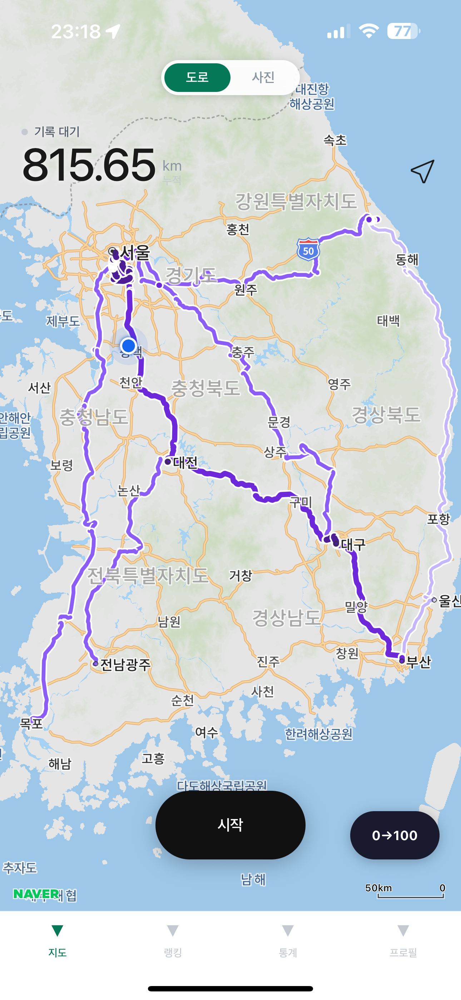
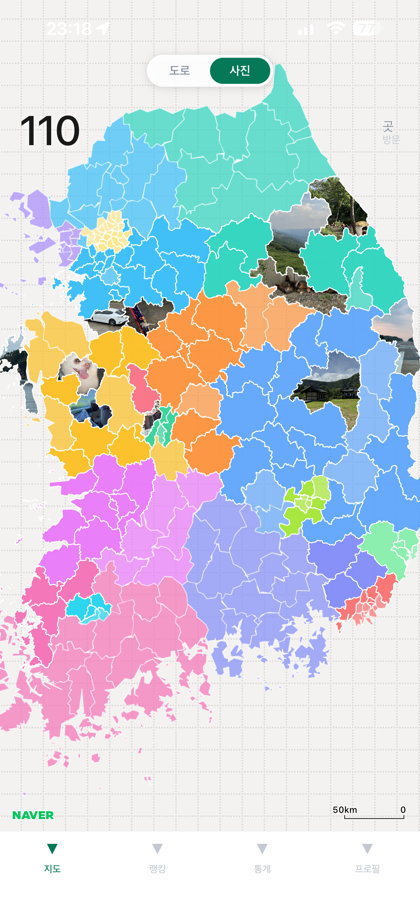
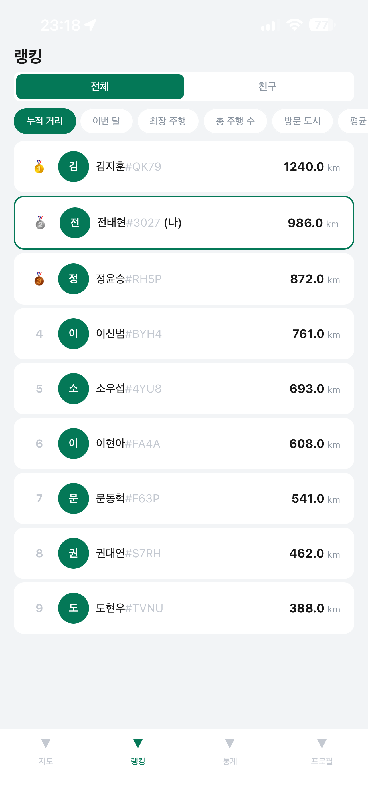
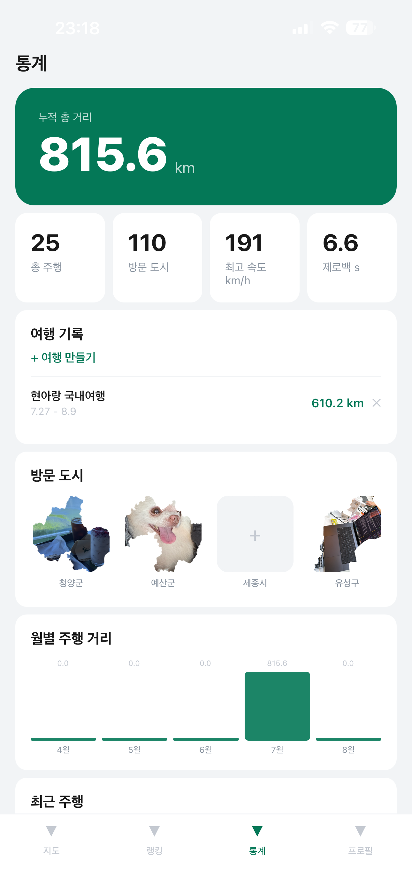
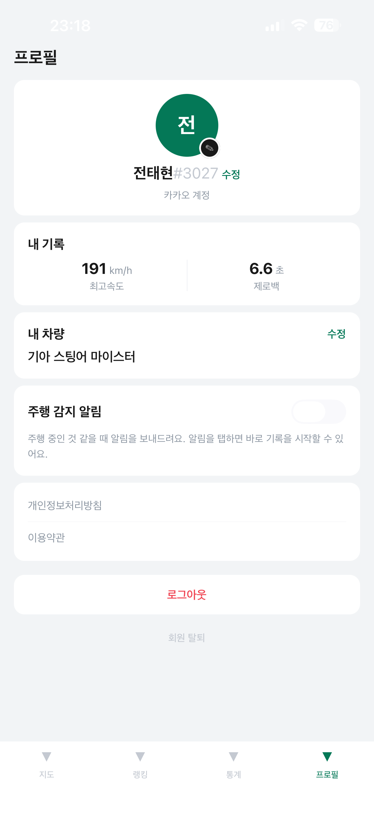

# Driend

**Drive + Friend** — 드라이브를 자동으로 기록하고, 방문한 지역을 모으고, 친구와 랭킹을 겨루는 한국 타겟 드라이브 기록 앱.

## 주요 기능

- **자동/수동 주행 기록** — 백그라운드에서 자동으로 주행 시작을 감지하고, 정차가 길어지면 알림 후 자동 종료. 경로는 Valhalla map-matching으로 도로 위에 스냅.
- **지도 시각화**
  - *도로 모드*: 내가 달린 경로를 통과 빈도에 따라 브랜드 그린 계열 그라데이션으로 표시
  - *사진 모드*: 전국 시/군/구(230개) 단위로 방문 지역을 채워나가는 모자이크 지도. 방문한 지역에는 실제 폴리곤 모양대로 잘린 사진을 스탬프로 등록 가능
- **통계** — 누적 거리, 월별 주행량, 여행(Trip) 단위 기록 묶기, 최근 주행 목록
- **제로백(0→100) 측정** — 가속도계 + GPS로 출발 순간과 100km/h 도달 시점을 감지해 자동 측정
- **랭킹 & 친구** — 누적 거리 / 최고속도 / 제로백 / 방문 도시 등 카테고리별 전체·친구 랭킹, 닉네임 검색 기반 친구 요청/수락
- **카카오 로그인** (게스트 로그인도 지원)

## 스크린샷

<table>
  <tr>
    <td align="center">메인 지도 (도로 모드)</td>
    <td align="center">지도 (사진 모드)</td>
    <td align="center">랭킹</td>
  </tr>
  <tr>
    <td></td>
    <td></td>
    <td></td>
  </tr>
  <tr>
    <td align="center">통계</td>
    <td align="center">프로필</td>
    <td></td>
  </tr>
  <tr>
    <td></td>
    <td></td>
    <td></td>
  </tr>
</table>

## 기술 스택

| 영역 | 사용 기술 |
|---|---|
| 클라이언트 | Expo SDK 56, React Native 0.85, TypeScript, Expo Router |
| 지도 | `@mj-studio/react-native-naver-map` (Naver Maps) |
| 상태 관리 | Zustand |
| 백엔드 | Supabase (PostgreSQL + PostGIS, Storage, Auth, Edge Functions) |
| 인증 | 카카오 로그인(`@react-native-kakao`), Supabase 익명 로그인 |
| 경로 맵매칭 | Mapbox Map Matching API (Supabase Edge Function에서 호출) |
| 사진 클리핑 | Supabase Edge Function + Jimp (지역 폴리곤 모양대로 픽셀 마스킹) |

## 프로젝트 구조

```
app/                    # Expo Router 화면 (파일 기반 라우팅)
  (auth)/               # 로그인
  (tabs)/               # 지도 / 랭킹 / 통계 / 프로필 탭
src/
  services/              # locationTracker, geo(point-in-polygon), mapMatcher, supabase 클라이언트 등
  components/             # 재사용 컴포넌트 (사진 크롭 UI 등)
  stores/                 # Zustand 스토어
  theme.ts                # 디자인 토큰
assets/                   # 아이콘, 로고, 시/군/구 GeoJSON(korea-cities.json)
supabase/
  migrations/             # DB 스키마 / RPC 함수
  functions/               # Edge Functions (카카오 인증, 맵매칭, 사진 클리핑)
ios/, android/            # 네이티브 프로젝트 (checked-in)
```

## 시작하기

App Store에서 다운로드할 수 있다.

[](https://apps.apple.com/kr/app/driend/id6794620035)

## 데이터베이스

`supabase/migrations/`에 스키마와 RPC 함수(랭킹 집계, 통계 조회 등)가 마이그레이션 단위로 정리되어 있다. `supabase/functions/`에는 카카오 인증 콜백, 경로 맵매칭, 사진 클리핑용 Edge Function이 있다.

## 알려진 한계

경로 시각화에서 왕복 도로가 지도에 평행선 2개로 표시될 수 있다. Valhalla map-matching이 편도/왕복 차선을 별도 center line(~40m 간격)으로 스냅하기 때문으로, 도로 토폴로지 데이터 없이는 해결이 어렵다.
